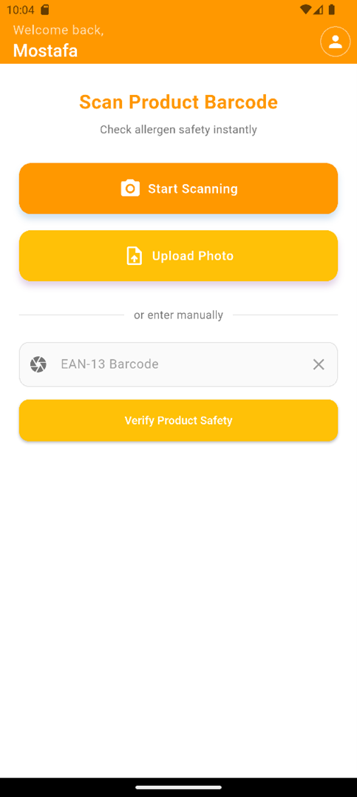
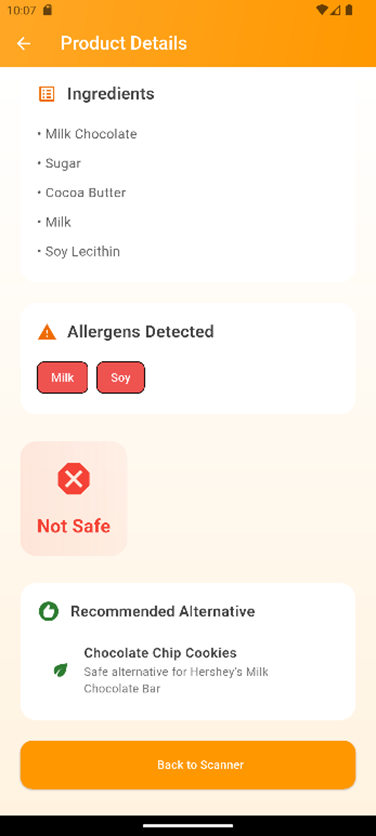
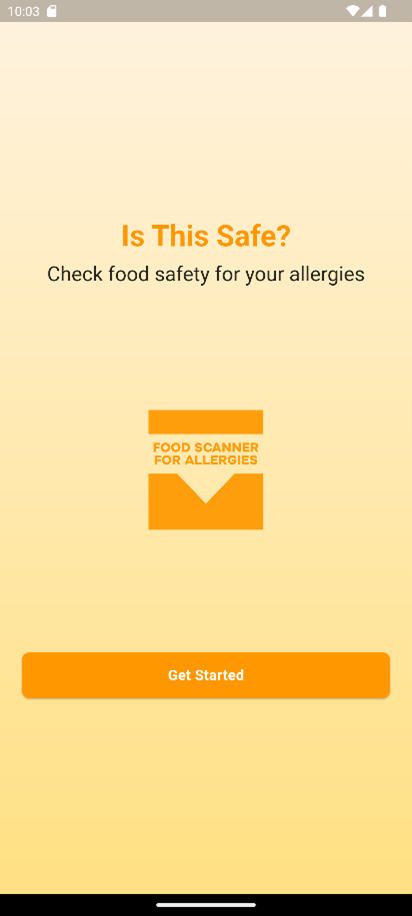
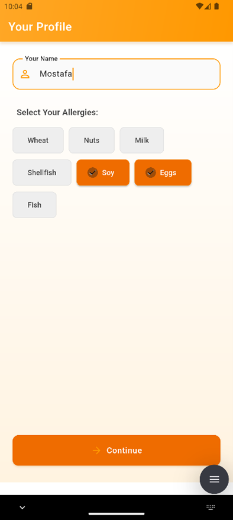

# 🍎 Food Safety Scanner

A Flutter application designed to help users with food allergies identify potentially harmful ingredients by scanning product barcodes. This project is built with a professional, scalable, and high-performance architecture focused on clean state management and an offline-first data strategy.

<p align="center">
  
  
</p>

---

## 🚀 Key Features & Architecture

This app is engineered with a modern architecture to ensure scalability, testability, and high performance.

### 1. State Management: `flutter_bloc` (Cubit)
The app's global state (like the user's profile and allergy list) is managed by a **`ProfileCubit`**, which acts as the **single source of truth**.
* **Reactive UI:** The UI reacts to state changes using `BlocBuilder` widgets, which automatically rebuild when the user's data changes.
* **Clean Architecture:** This approach creates a clean separation between the business logic (the "brain") and the UI (the "view"), eliminating the need for `setState` or passing data via callbacks.

### 2. Offline-First Database: `Hive`
The app provides an instant, offline-first experience by using a high-performance local database.
* **Optimized Data Layer:** On first launch, the app's `DatabaseService` parses a large `products.json` file and loads all items into a **Hive** database box.
* **Instant Lookups:** Product lookups are **instant (O(1) complexity)** using a key-value `_productBox.get(barcode)` method. This replaces a slow, inefficient `firstWhere` loop (O(n) complexity) that would parse the entire JSON file on every scan.

### 3. Asynchronous UI Handling
API calls, like fetching product recommendations, are handled safely to prevent redundant network requests and UI lag.
* The `Future` for the API call is initiated **once** in the `initState` method and stored in a local variable.
* The `FutureBuilder` then uses this stored `Future`, ensuring the API is not spammed every time the widget tree rebuilds (e.g., on a screen rotation).

---

## 📱 Screenshots

| Welcome Screen | Profile Setup | Home Screen | Safety Results |
| :---: | :---: | :---: | :---: |
|  |  |  |  |

---

## 🔧 Getting Started

### Requirements

* Flutter SDK
* Android Studio or VS Code

### Installation

1.  Clone the repository:
    ```bash
    git clone [https://github.com/MostafaL2003/Food-Scanner-For-Allergies.git](https://github.com/MostafaL2003/Food-Scanner-For-Allergies.git)
    ```
2.  Navigate to the project directory:
    ```bash
    cd Food-Scanner-For-Allergies/Flutter\ Code
    ```
3.  Install dependencies:
    ```bash
    flutter pub get
    ```
4.  Run the app:
    ```bash
    flutter run
    ```
